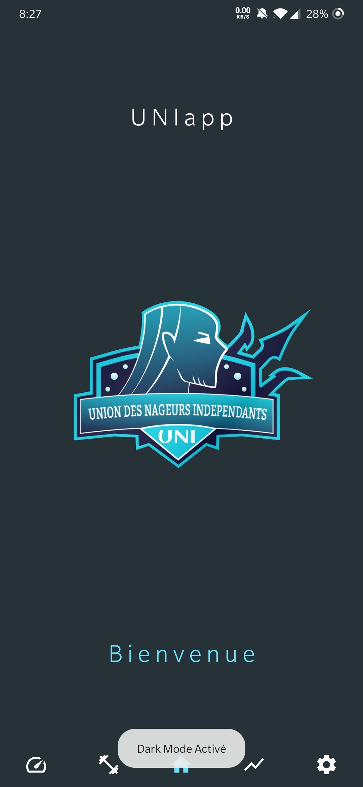
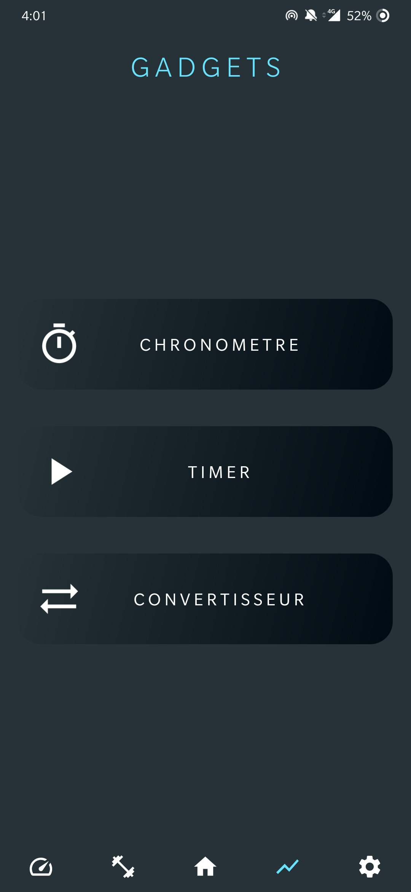
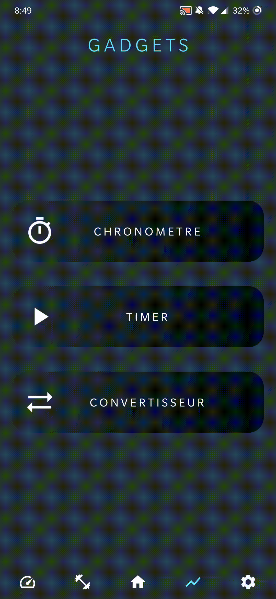

# Application UNI Android

## Présentation

Application Android avec architecture MVP en JAVA.

Projet d'application mobile pour le suivi de performance en natation à l'entrainement et en compétition

## Prérequis
- Installation de Android Studio
- Récupérer branche master

## Consignes respectées :
- Appel REST
- Ecran : 3 activités, 8 fragments
- Affichage de liste avec un RecyclerView
- Affichage des détails d'un item de la liste
- Stockage des données en cache (SharedPreferences pour le stockage rapide et non structurer, Room pour stockage avec plus de details)

- Les plus :
    - Singletons (Gson, Room, SharedPreferences, AppExecutor)
    - Modèle MVP
    - Clean architecture
    - Design
    - LineChart
    - GestureListener
    - Executor
    - AsyncTask
    - 5 Popup
    - Filtrage des listes en fonction d'une difficultée, d'une nage, d'une taille de piscine ou d'une distance
    - BottomNavigationView
    - dispatchKeyEvent
    
## Fonctionnalités : 

### Ecran Inscription

- Identification et configuration de l'utilisateur
- Si profil confirmé alors
    - Utilisateur redirigé vers le menu d'Accueil
    - Initialisation de l'utilisateur dans le cache (Room)
    - Initialisation des points ffn (54 000 données) avec AsyncTask et AppExecutor dans le cache (Room)
    - Initialisation des temps de compétition avec AsyncTask et AppExecutor dans le cache (Room)
- Sinon
    - Utilisateur redirigé vers l'écran d'inscription

### Ecran Accueil

- Ecran d'accueil
- Thème de l'application (Light ou dark)
- Thème qui peut se gérer automatiquement en fonction du thème du téléphone

   

### Ecran Compétition

- Selection des caractéristiques souhaitées (Taille du bassin, nage, distance) avec des :
    - Boutons pour la taille du bassin
    - GestureDetector pour les SwimCards
    - Spinner pour la distance
- Affichage de l'évolution des performances avec un graphique (LineChart)
- Affichage de toute les courses dans un RecyclerView
- Affichage des détails de la course dans une popup
- Ajout de nouvelle course dans une base de données Room avec une popup
    - Actualisation du graphe
- Suppression de course avec un SimpleCallback
    - Utilisation d'un Snackbar pour annuler la suppression
    - Actualisation du graphe

### Ecran Entrainement 

- Liste de tous les entrainements déjà enregistré (avec la série, le graphe des performance)
- Possibilité de trier les entrainements en fonction de la difficulté (de 1 à 5), de la nage et de la taille du bassin (25 mètres ou 50 mètres)
- Système d'ajout d'entrainement
- Details des entrainements dans un nouveau fragment
    - Details des blocks de l'entrainement
    - Comparaison des temps de l'entrainement avec les objectifs du nageur (en fonction des zones de vitesse)
    - Modification des temps de la série dans une popup

### Ecran Gadgets

- Menu avec des outils utile lors de l'entrainement

### Ecran Chronomètre

- Commande du chronomètre avec les boutons volumes du téléphone (permet d'être plus précis)
- Détail de tous les temps, temps globale, temps du tour, différence de temps avec le tour précédent
- Listing de tous les temps de passage dans un RecyclerView

### Ecran Timer

- Configuration des caractéristiques de l'entrainement
- Lancement d'une popup avec le timer
- Signal sonore à partir de 3 secondes qui annonce la fin du tour
- Possibilité de mettre en pause le timer en appuyant sur l'écran

### Ecran Convertisseur

- Convertisseur de temps en temps d'entrainement avec les zones
    - Z1 : 60% du temps de compétition
    - Z2 : 65% du temps de compétition
    - Z3 : 75% du temps de compétition
    - Z4 : 80% du temps de compétition
    - Z5 : 85% du temps de compétition
    - Z6 : 90% du temps de compétition
    - Z7 : 95% du temps de compétition
- Clavier qui se cache quand on appuie sur le bouton

### Ecran Paramètre

- Modification du profil (hors prénom et nom)
- Réinitialisation des temps de compétition
- Changement de thème
    - Valeur stocké dans le cache (SharefPreferences)

